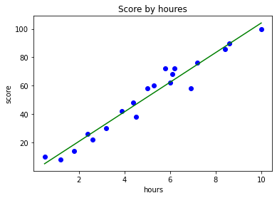
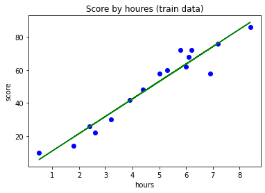
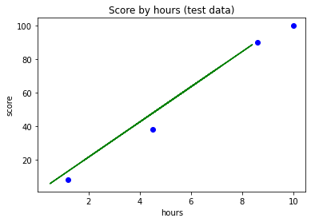
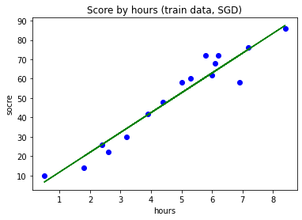
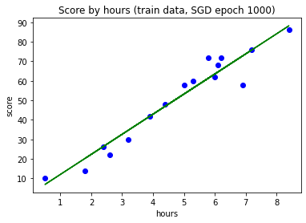
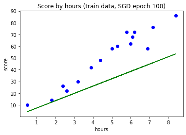
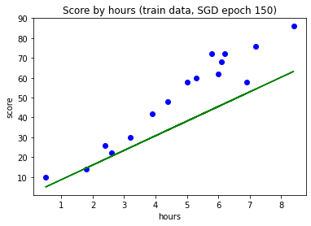

# 1. Linear Regression
y = mx + b
### 공부 시간에 따른 시험 점수


```python
import matplotlib.pyplot as plt
import pandas as pd
```


```python
dataset = pd.read_csv('LinearRegressionData.csv')
```


```python
dataset.head()
```


<div>

<table border="1" class="dataframe">
  <thead>
    <tr style="text-align: right;">
      <th></th>
      <th>hour</th>
      <th>score</th>
    </tr>
  </thead>
  <tbody>
    <tr>
      <th>0</th>
      <td>0.5</td>
      <td>10</td>
    </tr>
    <tr>
      <th>1</th>
      <td>1.2</td>
      <td>8</td>
    </tr>
    <tr>
      <th>2</th>
      <td>1.8</td>
      <td>14</td>
    </tr>
    <tr>
      <th>3</th>
      <td>2.4</td>
      <td>26</td>
    </tr>
    <tr>
      <th>4</th>
      <td>2.6</td>
      <td>22</td>
    </tr>
  </tbody>
</table>
</div>


```python
X = dataset.iloc[:, :-1].values # score 빼고 모든 열 (독립변수: 원인)
y = dataset.iloc[:, -1].values # score (종속변수: 결과)

X, y
```


    (array([[ 0.5],
            [ 1.2],
            [ 1.8],
            [ 2.4],
            [ 2.6],
            [ 3.2],
            [ 3.9],
            [ 4.4],
            [ 4.5],
            [ 5. ],
            [ 5.3],
            [ 5.8],
            [ 6. ],
            [ 6.1],
            [ 6.2],
            [ 6.9],
            [ 7.2],
            [ 8.4],
            [ 8.6],
            [10. ]]),
     array([ 10,   8,  14,  26,  22,  30,  42,  48,  38,  58,  60,  72,  62,
             68,  72,  58,  76,  86,  90, 100], dtype=int64))


```python
from sklearn.linear_model import LinearRegression
reg = LinearRegression() # 객체 생성
reg.fit(X, y) # 학습 (모델 생성)
```


```python
y_pred = reg.predict(X) # X에 대한 예측값
y_pred
```


    array([  5.00336377,  12.31395163,  18.58016979,  24.84638795,
            26.93512734,  33.20134551,  40.51193337,  45.73378184,
            46.77815153,  52.        ,  55.13310908,  60.35495755,
            62.44369694,  63.48806663,  64.53243633,  71.84302419,
            74.97613327,  87.5085696 ,  89.59730899, 104.2184847 ])


```python
plt.scatter(X, y, color='blue') # 산점도
plt.plot(X, y_pred, color='green') # 선 그래프
plt.title('Score by houres') # 제목
plt.xlabel('hours') # X 축 이름
plt.ylabel('score') # Y 축 이름
plt.show()
```


    

    


```python
print('9시간 공부했을 때 예상 점수 : ', reg.predict([[9]]))
# X 데이터가 2차원 배열이므로 대괄호 2번 넣음
```

    9시간 공부했을 때 예상 점수 :  [93.77478776]
    


```python
print('9시간, 8시간, 7시간 공부했을 때 예상 점수 : ', reg.predict([[9], [8], [7]]))
# 1차원 배열 3개로 묶어 2차원 배열로 나타냄
```

    9시간, 8시간, 7시간 공부했을 때 예상 점수 :  [93.77478776 83.33109082 72.88739388]
    


```python
reg.coef_ # 기울기 (m)
```


    array([10.44369694])


```python
reg.intercept_ # y 절편 (b)
```


    -0.21848470286721522


선을 나타내는 식 :\
y = 10.4436x - 0.2184


```python
print('9시간 공부했을 때 예상 점수 : ', 10.4436*9 - 0.2184)
```

    9시간 공부했을 때 예상 점수 :  93.774
    

### 데이터 세트 분리


```python
from sklearn.model_selection import train_test_split
X_train, X_test, y_train, y_test = train_test_split(X, y, test_size=0.2, random_state=0) # 훈련 80 : 테스트 20 으로 분리
```


```python
X, len(X) # 전체 데이터 X, X의 개수
```


    (array([[ 0.5],
            [ 1.2],
            [ 1.8],
            [ 2.4],
            [ 2.6],
            [ 3.2],
            [ 3.9],
            [ 4.4],
            [ 4.5],
            [ 5. ],
            [ 5.3],
            [ 5.8],
            [ 6. ],
            [ 6.1],
            [ 6.2],
            [ 6.9],
            [ 7.2],
            [ 8.4],
            [ 8.6],
            [10. ]]),
     20)


```python
X_train, len(X_train) # 훈련 세트 X, X의 개수 (20*0.8=16)
```


    (array([[5.3],
            [8.4],
            [3.9],
            [6.1],
            [2.6],
            [1.8],
            [3.2],
            [6.2],
            [5. ],
            [4.4],
            [7.2],
            [5.8],
            [2.4],
            [0.5],
            [6.9],
            [6. ]]),
     16)


```python
X_test, len(X_test) # 테스트 세트 X, X의 개수
```


    (array([[ 8.6],
            [ 1.2],
            [10. ],
            [ 4.5]]),
     4)


```python
y, len(y) # 전체 데이터 y
```


    (array([ 10,   8,  14,  26,  22,  30,  42,  48,  38,  58,  60,  72,  62,
             68,  72,  58,  76,  86,  90, 100], dtype=int64),
     20)


```python
y_train, len(y_train) # 훈련 세트 y
```


    (array([60, 86, 42, 68, 22, 14, 30, 72, 58, 48, 76, 72, 26, 10, 58, 62],
           dtype=int64),
     16)


```python
y_test, len(y_test) # 테스트 세트 y
```


    (array([ 90,   8, 100,  38], dtype=int64), 4)


### 분리된 데이터를 통한 모델링


```python
reg = LinearRegression()
```


```python
reg.fit(X_train, y_train) # 훈련 세트로 학습
```


### 데이터 시각화 (훈련 세트)


```python
plt.scatter(X_train, y_train, color='blue')
plt.plot(X_train, reg.predict(X_train), color='green')
plt.title('Score by houres (train data)')
plt.xlabel('hours')
plt.ylabel('score')
plt.show()
```


    

    


### 데이터 시각화 (테스트 세트)


```python
plt.scatter(X_test, y_test, color='blue')
plt.plot(X_train, reg.predict(X_train), color='green') # 선 그래프는 그대로
plt.title('Score by hours (test data)')
plt.xlabel('hours')
plt.ylabel('score')
plt.show()
```


    

    


```python
reg.coef_
```


    array([10.49161294])


```python
reg.intercept_
```


    0.6115562905169796


기울기와 y 절편이 약간 달라짐

### 모델 평가


```python
reg.score(X_test, y_test) # 테스트 세트를 통한 모델 평가
```


    0.9727616474310156


```python
reg.score(X_train, y_train) # 훈련 세트를 통한 모델 평가
```


    0.9356663661221668


## 경사 하강법 (Gradient Descent)


```python
from sklearn.linear_model import SGDRegressor # SGD : Stochastic Gradient Descent (확률적 경사 하강법)
sr = SGDRegressor()
sr.fit(X_train, y_train)
```


```python
plt.scatter(X_train, y_train, color='blue')
plt.plot(X_train, sr.predict(X_train), color='green')
plt.title('Score by hours (train data, SGD)')
plt.xlabel('hours')
plt.ylabel('socre')
plt.show()
```


    

    


앞선 그래프(선형회귀)와 거의 유사


```python
sr.coef_, sr.intercept_
```


    (array([10.22463419]), array([1.58008779]))


```python
sr.score(X_test, y_test) # 테스트 세트를 통한 모델 평가
```


    0.975178691269555


```python
sr.score(X_train, y_train) # 훈련 세트를 통한 모델 평가
```


    0.9348943449000586


좋은 모델은 훈련 세트의 점수가 더 높고 테스트 세트의 점수가 더 낮음\
지금은 데이터가 워낙 적어서 반대로 나타남

#### SGDRegressor 파라미터

max_iter : 훈련 세트 반복 횟수 (Epoch 횟수)

eta0 : 학습률 (learning rate)
- 지수표기법

verbose = 1 : 훈련 세트 반복하며 손실률 줄어드는 것 가시화

지수표기법
- 1e-3 : 0.001 (10^-3)
- 1e-4 : 0.0001 (10^-4)
- 1e+3 : 1000 (10^3)
- 1e+4 : 10000 (10^4)


```python
sr = SGDRegressor(max_iter=1000, eta0=0.001, random_state=0, verbose=1)
sr.fit(X_train, y_train)
```

    -- Epoch 1
    Norm: 2.40, NNZs: 1, Bias: 0.442470, T: 16, Avg. loss: 1181.034371
    Total training time: 0.00 seconds.
    -- Epoch 2
    Norm: 3.84, NNZs: 1, Bias: 0.697455, T: 32, Avg. loss: 754.011321
    Total training time: 0.00 seconds.
    -- Epoch 3
    Norm: 4.89, NNZs: 1, Bias: 0.881472, T: 48, Avg. loss: 520.842928
    Total training time: 0.00 seconds.
    -- Epoch 4
    Norm: 5.70, NNZs: 1, Bias: 1.023556, T: 64, Avg. loss: 374.527388
    Total training time: 0.00 seconds.
    -- Epoch 5
    Norm: 6.34, NNZs: 1, Bias: 1.137258, T: 80, Avg. loss: 277.717040
    Total training time: 0.00 seconds.
    -- Epoch 6
    Norm: 6.88, NNZs: 1, Bias: 1.230635, T: 96, Avg. loss: 210.603548
    Total training time: 0.00 seconds.
    -- Epoch 7
    Norm: 7.32, NNZs: 1, Bias: 1.308149, T: 112, Avg. loss: 162.433366
    Total training time: 0.00 seconds.
    -- Epoch 8
    Norm: 7.69, NNZs: 1, Bias: 1.372847, T: 128, Avg. loss: 127.468199
    Total training time: 0.00 seconds.
    -- Epoch 9
    Norm: 8.01, NNZs: 1, Bias: 1.427757, T: 144, Avg. loss: 101.814505
    Total training time: 0.00 seconds.
    -- Epoch 10
    Norm: 8.28, NNZs: 1, Bias: 1.474953, T: 160, Avg. loss: 82.674196
    Total training time: 0.00 seconds.
    -- Epoch 11
    Norm: 8.51, NNZs: 1, Bias: 1.515486, T: 176, Avg. loss: 68.085082
    Total training time: 0.00 seconds.
    -- Epoch 12
    Norm: 8.71, NNZs: 1, Bias: 1.549985, T: 192, Avg. loss: 57.005190
    Total training time: 0.00 seconds.
    -- Epoch 13
    Norm: 8.88, NNZs: 1, Bias: 1.580062, T: 208, Avg. loss: 48.534157
    Total training time: 0.00 seconds.
    -- Epoch 14
    Norm: 9.04, NNZs: 1, Bias: 1.606388, T: 224, Avg. loss: 41.986284
    Total training time: 0.00 seconds.
    -- Epoch 15
    Norm: 9.17, NNZs: 1, Bias: 1.629265, T: 240, Avg. loss: 36.843002
    Total training time: 0.00 seconds.
    -- Epoch 16
    Norm: 9.29, NNZs: 1, Bias: 1.649170, T: 256, Avg. loss: 32.831436
    Total training time: 0.00 seconds.
    -- Epoch 17
    Norm: 9.39, NNZs: 1, Bias: 1.666531, T: 272, Avg. loss: 29.701149
    Total training time: 0.00 seconds.
    -- Epoch 18
    Norm: 9.48, NNZs: 1, Bias: 1.682057, T: 288, Avg. loss: 27.231481
    Total training time: 0.00 seconds.
    -- Epoch 19
    Norm: 9.56, NNZs: 1, Bias: 1.695737, T: 304, Avg. loss: 25.239918
    Total training time: 0.00 seconds.
    -- Epoch 20
    Norm: 9.63, NNZs: 1, Bias: 1.707648, T: 320, Avg. loss: 23.666198
    Total training time: 0.00 seconds.
    -- Epoch 21
    Norm: 9.70, NNZs: 1, Bias: 1.717986, T: 336, Avg. loss: 22.423381
    Total training time: 0.00 seconds.
    -- Epoch 22
    Norm: 9.75, NNZs: 1, Bias: 1.727520, T: 352, Avg. loss: 21.423074
    Total training time: 0.00 seconds.
    -- Epoch 23
    Norm: 9.81, NNZs: 1, Bias: 1.735911, T: 368, Avg. loss: 20.599154
    Total training time: 0.00 seconds.
    -- Epoch 24
    Norm: 9.85, NNZs: 1, Bias: 1.743059, T: 384, Avg. loss: 19.946664
    Total training time: 0.00 seconds.
    -- Epoch 25
    Norm: 9.89, NNZs: 1, Bias: 1.749411, T: 400, Avg. loss: 19.425241
    Total training time: 0.00 seconds.
    -- Epoch 26
    Norm: 9.93, NNZs: 1, Bias: 1.755224, T: 416, Avg. loss: 19.006171
    Total training time: 0.00 seconds.
    -- Epoch 27
    Norm: 9.96, NNZs: 1, Bias: 1.760444, T: 432, Avg. loss: 18.649850
    Total training time: 0.00 seconds.
    -- Epoch 28
    Norm: 9.99, NNZs: 1, Bias: 1.764855, T: 448, Avg. loss: 18.364863
    Total training time: 0.00 seconds.
    -- Epoch 29
    Norm: 10.02, NNZs: 1, Bias: 1.768742, T: 464, Avg. loss: 18.136890
    Total training time: 0.00 seconds.
    -- Epoch 30
    Norm: 10.04, NNZs: 1, Bias: 1.772303, T: 480, Avg. loss: 17.954396
    Total training time: 0.00 seconds.
    -- Epoch 31
    Norm: 10.06, NNZs: 1, Bias: 1.775650, T: 496, Avg. loss: 17.789278
    Total training time: 0.00 seconds.
    -- Epoch 32
    Norm: 10.08, NNZs: 1, Bias: 1.778365, T: 512, Avg. loss: 17.661331
    Total training time: 0.00 seconds.
    -- Epoch 33
    Norm: 10.10, NNZs: 1, Bias: 1.780615, T: 528, Avg. loss: 17.556661
    Total training time: 0.00 seconds.
    -- Epoch 34
    Norm: 10.11, NNZs: 1, Bias: 1.782892, T: 544, Avg. loss: 17.473956
    Total training time: 0.00 seconds.
    -- Epoch 35
    Norm: 10.13, NNZs: 1, Bias: 1.784920, T: 560, Avg. loss: 17.398214
    Total training time: 0.00 seconds.
    -- Epoch 36
    Norm: 10.14, NNZs: 1, Bias: 1.786514, T: 576, Avg. loss: 17.338250
    Total training time: 0.00 seconds.
    -- Epoch 37
    Norm: 10.15, NNZs: 1, Bias: 1.787809, T: 592, Avg. loss: 17.288143
    Total training time: 0.00 seconds.
    -- Epoch 38
    Norm: 10.16, NNZs: 1, Bias: 1.789211, T: 608, Avg. loss: 17.250074
    Total training time: 0.00 seconds.
    -- Epoch 39
    Norm: 10.17, NNZs: 1, Bias: 1.790389, T: 624, Avg. loss: 17.214517
    Total training time: 0.00 seconds.
    -- Epoch 40
    Norm: 10.18, NNZs: 1, Bias: 1.791332, T: 640, Avg. loss: 17.184784
    Total training time: 0.00 seconds.
    -- Epoch 41
    Norm: 10.19, NNZs: 1, Bias: 1.792025, T: 656, Avg. loss: 17.159879
    Total training time: 0.00 seconds.
    -- Epoch 42
    Norm: 10.20, NNZs: 1, Bias: 1.792728, T: 672, Avg. loss: 17.143211
    Total training time: 0.00 seconds.
    -- Epoch 43
    Norm: 10.21, NNZs: 1, Bias: 1.793462, T: 688, Avg. loss: 17.122124
    Total training time: 0.00 seconds.
    -- Epoch 44
    Norm: 10.21, NNZs: 1, Bias: 1.793882, T: 704, Avg. loss: 17.109227
    Total training time: 0.01 seconds.
    -- Epoch 45
    Norm: 10.22, NNZs: 1, Bias: 1.794138, T: 720, Avg. loss: 17.096271
    Total training time: 0.01 seconds.
    -- Epoch 46
    Norm: 10.22, NNZs: 1, Bias: 1.794484, T: 736, Avg. loss: 17.089082
    Total training time: 0.01 seconds.
    -- Epoch 47
    Norm: 10.23, NNZs: 1, Bias: 1.794875, T: 752, Avg. loss: 17.076854
    Total training time: 0.01 seconds.
    -- Epoch 48
    Norm: 10.23, NNZs: 1, Bias: 1.794946, T: 768, Avg. loss: 17.070864
    Total training time: 0.01 seconds.
    -- Epoch 49
    Norm: 10.23, NNZs: 1, Bias: 1.794972, T: 784, Avg. loss: 17.063910
    Total training time: 0.01 seconds.
    -- Epoch 50
    Norm: 10.24, NNZs: 1, Bias: 1.795102, T: 800, Avg. loss: 17.060152
    Total training time: 0.01 seconds.
    -- Epoch 51
    Norm: 10.24, NNZs: 1, Bias: 1.795160, T: 816, Avg. loss: 17.055316
    Total training time: 0.01 seconds.
    -- Epoch 52
    Norm: 10.24, NNZs: 1, Bias: 1.795090, T: 832, Avg. loss: 17.050635
    Total training time: 0.01 seconds.
    -- Epoch 53
    Norm: 10.25, NNZs: 1, Bias: 1.794892, T: 848, Avg. loss: 17.046109
    Total training time: 0.01 seconds.
    -- Epoch 54
    Norm: 10.25, NNZs: 1, Bias: 1.794834, T: 864, Avg. loss: 17.044928
    Total training time: 0.01 seconds.
    -- Epoch 55
    Norm: 10.25, NNZs: 1, Bias: 1.794763, T: 880, Avg. loss: 17.041549
    Total training time: 0.01 seconds.
    -- Epoch 56
    Norm: 10.25, NNZs: 1, Bias: 1.794559, T: 896, Avg. loss: 17.039110
    Total training time: 0.01 seconds.
    -- Epoch 57
    Norm: 10.26, NNZs: 1, Bias: 1.794203, T: 912, Avg. loss: 17.035666
    Total training time: 0.01 seconds.
    -- Epoch 58
    Norm: 10.26, NNZs: 1, Bias: 1.794083, T: 928, Avg. loss: 17.035048
    Total training time: 0.01 seconds.
    -- Epoch 59
    Norm: 10.26, NNZs: 1, Bias: 1.793933, T: 944, Avg. loss: 17.032884
    Total training time: 0.01 seconds.
    -- Epoch 60
    Norm: 10.26, NNZs: 1, Bias: 1.793557, T: 960, Avg. loss: 17.031787
    Total training time: 0.01 seconds.
    -- Epoch 61
    Norm: 10.26, NNZs: 1, Bias: 1.793166, T: 976, Avg. loss: 17.029581
    Total training time: 0.01 seconds.
    -- Epoch 62
    Norm: 10.26, NNZs: 1, Bias: 1.792895, T: 992, Avg. loss: 17.030173
    Total training time: 0.01 seconds.
    -- Epoch 63
    Norm: 10.27, NNZs: 1, Bias: 1.792659, T: 1008, Avg. loss: 17.028212
    Total training time: 0.01 seconds.
    -- Epoch 64
    Norm: 10.27, NNZs: 1, Bias: 1.792245, T: 1024, Avg. loss: 17.027210
    Total training time: 0.01 seconds.
    -- Epoch 65
    Norm: 10.27, NNZs: 1, Bias: 1.791800, T: 1040, Avg. loss: 17.025539
    Total training time: 0.01 seconds.
    -- Epoch 66
    Norm: 10.27, NNZs: 1, Bias: 1.791443, T: 1056, Avg. loss: 17.026490
    Total training time: 0.01 seconds.
    -- Epoch 67
    Norm: 10.27, NNZs: 1, Bias: 1.791213, T: 1072, Avg. loss: 17.023387
    Total training time: 0.01 seconds.
    -- Epoch 68
    Norm: 10.27, NNZs: 1, Bias: 1.790789, T: 1088, Avg. loss: 17.024484
    Total training time: 0.01 seconds.
    -- Epoch 69
    Norm: 10.27, NNZs: 1, Bias: 1.790246, T: 1104, Avg. loss: 17.021737
    Total training time: 0.01 seconds.
    -- Epoch 70
    Norm: 10.27, NNZs: 1, Bias: 1.789921, T: 1120, Avg. loss: 17.023017
    Total training time: 0.01 seconds.
    -- Epoch 71
    Norm: 10.27, NNZs: 1, Bias: 1.789604, T: 1136, Avg. loss: 17.022113
    Total training time: 0.01 seconds.
    -- Epoch 72
    Norm: 10.27, NNZs: 1, Bias: 1.789135, T: 1152, Avg. loss: 17.021883
    Total training time: 0.01 seconds.
    -- Epoch 73
    Norm: 10.27, NNZs: 1, Bias: 1.788587, T: 1168, Avg. loss: 17.019247
    Total training time: 0.01 seconds.
    -- Epoch 74
    Norm: 10.27, NNZs: 1, Bias: 1.788250, T: 1184, Avg. loss: 17.020409
    Total training time: 0.01 seconds.
    -- Epoch 75
    Norm: 10.28, NNZs: 1, Bias: 1.787875, T: 1200, Avg. loss: 17.020398
    Total training time: 0.01 seconds.
    -- Epoch 76
    Norm: 10.28, NNZs: 1, Bias: 1.787434, T: 1216, Avg. loss: 17.019802
    Total training time: 0.01 seconds.
    -- Epoch 77
    Norm: 10.28, NNZs: 1, Bias: 1.786903, T: 1232, Avg. loss: 17.018054
    Total training time: 0.01 seconds.
    -- Epoch 78
    Norm: 10.28, NNZs: 1, Bias: 1.786466, T: 1248, Avg. loss: 17.019270
    Total training time: 0.01 seconds.
    -- Epoch 79
    Norm: 10.28, NNZs: 1, Bias: 1.786135, T: 1264, Avg. loss: 17.016863
    Total training time: 0.01 seconds.
    -- Epoch 80
    Norm: 10.28, NNZs: 1, Bias: 1.785643, T: 1280, Avg. loss: 17.017837
    Total training time: 0.01 seconds.
    -- Epoch 81
    Norm: 10.28, NNZs: 1, Bias: 1.785090, T: 1296, Avg. loss: 17.016077
    Total training time: 0.01 seconds.
    -- Epoch 82
    Norm: 10.28, NNZs: 1, Bias: 1.784664, T: 1312, Avg. loss: 17.017397
    Total training time: 0.01 seconds.
    -- Epoch 83
    Norm: 10.28, NNZs: 1, Bias: 1.784330, T: 1328, Avg. loss: 17.015116
    Total training time: 0.01 seconds.
    -- Epoch 84
    Norm: 10.28, NNZs: 1, Bias: 1.783802, T: 1344, Avg. loss: 17.015926
    Total training time: 0.01 seconds.
    Convergence after 84 epochs took 0.01 seconds
    


```python
plt.scatter(X_train, y_train, color='blue')
plt.plot(X_train, sr.predict(X_train), color='green')
plt.title('Score by hours (train data, SGD epoch 1000)')
plt.xlabel('hours')
plt.ylabel('score')
plt.show()
```


    

    


```python
# max_iter 값을 1000 -> 100 수정
# eta0 값을 1e-3 -> 1e-4 수정
sr = SGDRegressor(max_iter=100, eta0=1e-4, random_state=0, verbose=1)
sr.fit(X_train, y_train)
```

    -- Epoch 1
    Norm: 0.27, NNZs: 1, Bias: 0.048869, T: 16, Avg. loss: 1484.241876
    Total training time: 0.00 seconds.
    -- Epoch 2
    Norm: 0.47, NNZs: 1, Bias: 0.083896, T: 32, Avg. loss: 1419.741822
    Total training time: 0.00 seconds.
    -- Epoch 3
    Norm: 0.64, NNZs: 1, Bias: 0.114272, T: 48, Avg. loss: 1367.983092
    Total training time: 0.00 seconds.
    -- Epoch 4
    Norm: 0.79, NNZs: 1, Bias: 0.141552, T: 64, Avg. loss: 1322.870279
    Total training time: 0.00 seconds.
    -- Epoch 5
    Norm: 0.94, NNZs: 1, Bias: 0.166772, T: 80, Avg. loss: 1282.550224
    Total training time: 0.00 seconds.
    -- Epoch 6
    Norm: 1.07, NNZs: 1, Bias: 0.190476, T: 96, Avg. loss: 1245.587071
    Total training time: 0.00 seconds.
    -- Epoch 7
    Norm: 1.20, NNZs: 1, Bias: 0.212877, T: 112, Avg. loss: 1211.227118
    Total training time: 0.00 seconds.
    -- Epoch 8
    Norm: 1.32, NNZs: 1, Bias: 0.234194, T: 128, Avg. loss: 1179.037565
    Total training time: 0.00 seconds.
    -- Epoch 9
    Norm: 1.43, NNZs: 1, Bias: 0.254556, T: 144, Avg. loss: 1148.814106
    Total training time: 0.00 seconds.
    -- Epoch 10
    Norm: 1.54, NNZs: 1, Bias: 0.274134, T: 160, Avg. loss: 1120.251662
    Total training time: 0.00 seconds.
    -- Epoch 11
    Norm: 1.65, NNZs: 1, Bias: 0.292981, T: 176, Avg. loss: 1093.110571
    Total training time: 0.00 seconds.
    -- Epoch 12
    Norm: 1.75, NNZs: 1, Bias: 0.311189, T: 192, Avg. loss: 1067.211902
    Total training time: 0.00 seconds.
    -- Epoch 13
    Norm: 1.85, NNZs: 1, Bias: 0.328785, T: 208, Avg. loss: 1042.516297
    Total training time: 0.00 seconds.
    -- Epoch 14
    Norm: 1.95, NNZs: 1, Bias: 0.345870, T: 224, Avg. loss: 1018.879566
    Total training time: 0.00 seconds.
    -- Epoch 15
    Norm: 2.04, NNZs: 1, Bias: 0.362460, T: 240, Avg. loss: 996.181074
    Total training time: 0.00 seconds.
    -- Epoch 16
    Norm: 2.13, NNZs: 1, Bias: 0.378587, T: 256, Avg. loss: 974.361266
    Total training time: 0.00 seconds.
    -- Epoch 17
    Norm: 2.22, NNZs: 1, Bias: 0.394284, T: 272, Avg. loss: 953.386926
    Total training time: 0.00 seconds.
    -- Epoch 18
    Norm: 2.31, NNZs: 1, Bias: 0.409594, T: 288, Avg. loss: 933.187164
    Total training time: 0.00 seconds.
    -- Epoch 19
    Norm: 2.39, NNZs: 1, Bias: 0.424528, T: 304, Avg. loss: 913.690408
    Total training time: 0.00 seconds.
    -- Epoch 20
    Norm: 2.48, NNZs: 1, Bias: 0.439104, T: 320, Avg. loss: 894.861051
    Total training time: 0.00 seconds.
    -- Epoch 21
    Norm: 2.56, NNZs: 1, Bias: 0.453350, T: 336, Avg. loss: 876.666125
    Total training time: 0.00 seconds.
    -- Epoch 22
    Norm: 2.64, NNZs: 1, Bias: 0.467285, T: 352, Avg. loss: 859.068639
    Total training time: 0.00 seconds.
    -- Epoch 23
    Norm: 2.71, NNZs: 1, Bias: 0.480921, T: 368, Avg. loss: 842.018081
    Total training time: 0.00 seconds.
    -- Epoch 24
    Norm: 2.79, NNZs: 1, Bias: 0.494273, T: 384, Avg. loss: 825.486145
    Total training time: 0.00 seconds.
    -- Epoch 25
    Norm: 2.86, NNZs: 1, Bias: 0.507351, T: 400, Avg. loss: 809.468053
    Total training time: 0.00 seconds.
    -- Epoch 26
    Norm: 2.94, NNZs: 1, Bias: 0.520178, T: 416, Avg. loss: 793.927559
    Total training time: 0.00 seconds.
    -- Epoch 27
    Norm: 3.01, NNZs: 1, Bias: 0.532755, T: 432, Avg. loss: 778.832690
    Total training time: 0.00 seconds.
    -- Epoch 28
    Norm: 3.08, NNZs: 1, Bias: 0.545094, T: 448, Avg. loss: 764.166106
    Total training time: 0.00 seconds.
    -- Epoch 29
    Norm: 3.15, NNZs: 1, Bias: 0.557201, T: 464, Avg. loss: 749.924129
    Total training time: 0.00 seconds.
    -- Epoch 30
    Norm: 3.21, NNZs: 1, Bias: 0.569097, T: 480, Avg. loss: 736.071588
    Total training time: 0.00 seconds.
    -- Epoch 31
    Norm: 3.28, NNZs: 1, Bias: 0.580779, T: 496, Avg. loss: 722.588889
    Total training time: 0.00 seconds.
    -- Epoch 32
    Norm: 3.35, NNZs: 1, Bias: 0.592258, T: 512, Avg. loss: 709.462708
    Total training time: 0.00 seconds.
    -- Epoch 33
    Norm: 3.41, NNZs: 1, Bias: 0.603540, T: 528, Avg. loss: 696.686817
    Total training time: 0.00 seconds.
    -- Epoch 34
    Norm: 3.47, NNZs: 1, Bias: 0.614639, T: 544, Avg. loss: 684.244367
    Total training time: 0.00 seconds.
    -- Epoch 35
    Norm: 3.53, NNZs: 1, Bias: 0.625553, T: 560, Avg. loss: 672.113885
    Total training time: 0.00 seconds.
    -- Epoch 36
    Norm: 3.60, NNZs: 1, Bias: 0.636290, T: 576, Avg. loss: 660.287442
    Total training time: 0.00 seconds.
    -- Epoch 37
    Norm: 3.65, NNZs: 1, Bias: 0.646855, T: 592, Avg. loss: 648.762655
    Total training time: 0.00 seconds.
    -- Epoch 38
    Norm: 3.71, NNZs: 1, Bias: 0.657258, T: 608, Avg. loss: 637.523840
    Total training time: 0.00 seconds.
    -- Epoch 39
    Norm: 3.77, NNZs: 1, Bias: 0.667499, T: 624, Avg. loss: 626.551012
    Total training time: 0.01 seconds.
    -- Epoch 40
    Norm: 3.83, NNZs: 1, Bias: 0.677582, T: 640, Avg. loss: 615.839418
    Total training time: 0.01 seconds.
    -- Epoch 41
    Norm: 3.89, NNZs: 1, Bias: 0.687514, T: 656, Avg. loss: 605.386802
    Total training time: 0.01 seconds.
    -- Epoch 42
    Norm: 3.94, NNZs: 1, Bias: 0.697302, T: 672, Avg. loss: 595.179604
    Total training time: 0.01 seconds.
    -- Epoch 43
    Norm: 4.00, NNZs: 1, Bias: 0.706946, T: 688, Avg. loss: 585.205525
    Total training time: 0.01 seconds.
    -- Epoch 44
    Norm: 4.05, NNZs: 1, Bias: 0.716450, T: 704, Avg. loss: 575.458493
    Total training time: 0.01 seconds.
    -- Epoch 45
    Norm: 4.10, NNZs: 1, Bias: 0.725819, T: 720, Avg. loss: 565.937753
    Total training time: 0.01 seconds.
    -- Epoch 46
    Norm: 4.16, NNZs: 1, Bias: 0.735059, T: 736, Avg. loss: 556.633179
    Total training time: 0.01 seconds.
    -- Epoch 47
    Norm: 4.21, NNZs: 1, Bias: 0.744168, T: 752, Avg. loss: 547.533995
    Total training time: 0.01 seconds.
    -- Epoch 48
    Norm: 4.26, NNZs: 1, Bias: 0.753152, T: 768, Avg. loss: 538.632849
    Total training time: 0.01 seconds.
    -- Epoch 49
    Norm: 4.31, NNZs: 1, Bias: 0.762013, T: 784, Avg. loss: 529.930377
    Total training time: 0.01 seconds.
    -- Epoch 50
    Norm: 4.36, NNZs: 1, Bias: 0.770757, T: 800, Avg. loss: 521.417265
    Total training time: 0.01 seconds.
    -- Epoch 51
    Norm: 4.41, NNZs: 1, Bias: 0.779384, T: 816, Avg. loss: 513.084023
    Total training time: 0.01 seconds.
    -- Epoch 52
    Norm: 4.46, NNZs: 1, Bias: 0.787897, T: 832, Avg. loss: 504.927495
    Total training time: 0.01 seconds.
    -- Epoch 53
    Norm: 4.50, NNZs: 1, Bias: 0.796299, T: 848, Avg. loss: 496.946253
    Total training time: 0.01 seconds.
    -- Epoch 54
    Norm: 4.55, NNZs: 1, Bias: 0.804596, T: 864, Avg. loss: 489.133754
    Total training time: 0.01 seconds.
    -- Epoch 55
    Norm: 4.60, NNZs: 1, Bias: 0.812785, T: 880, Avg. loss: 481.481960
    Total training time: 0.01 seconds.
    -- Epoch 56
    Norm: 4.64, NNZs: 1, Bias: 0.820869, T: 896, Avg. loss: 473.988460
    Total training time: 0.01 seconds.
    -- Epoch 57
    Norm: 4.69, NNZs: 1, Bias: 0.828852, T: 912, Avg. loss: 466.649980
    Total training time: 0.01 seconds.
    -- Epoch 58
    Norm: 4.73, NNZs: 1, Bias: 0.836738, T: 928, Avg. loss: 459.461740
    Total training time: 0.01 seconds.
    -- Epoch 59
    Norm: 4.78, NNZs: 1, Bias: 0.844525, T: 944, Avg. loss: 452.416650
    Total training time: 0.01 seconds.
    -- Epoch 60
    Norm: 4.82, NNZs: 1, Bias: 0.852216, T: 960, Avg. loss: 445.511862
    Total training time: 0.01 seconds.
    -- Epoch 61
    Norm: 4.86, NNZs: 1, Bias: 0.859815, T: 976, Avg. loss: 438.747190
    Total training time: 0.01 seconds.
    -- Epoch 62
    Norm: 4.91, NNZs: 1, Bias: 0.867324, T: 992, Avg. loss: 432.117062
    Total training time: 0.01 seconds.
    -- Epoch 63
    Norm: 4.95, NNZs: 1, Bias: 0.874743, T: 1008, Avg. loss: 425.615654
    Total training time: 0.01 seconds.
    -- Epoch 64
    Norm: 4.99, NNZs: 1, Bias: 0.882073, T: 1024, Avg. loss: 419.241080
    Total training time: 0.01 seconds.
    -- Epoch 65
    Norm: 5.03, NNZs: 1, Bias: 0.889318, T: 1040, Avg. loss: 412.993260
    Total training time: 0.01 seconds.
    -- Epoch 66
    Norm: 5.07, NNZs: 1, Bias: 0.896479, T: 1056, Avg. loss: 406.865688
    Total training time: 0.01 seconds.
    -- Epoch 67
    Norm: 5.11, NNZs: 1, Bias: 0.903557, T: 1072, Avg. loss: 400.853820
    Total training time: 0.01 seconds.
    -- Epoch 68
    Norm: 5.15, NNZs: 1, Bias: 0.910553, T: 1088, Avg. loss: 394.956171
    Total training time: 0.01 seconds.
    -- Epoch 69
    Norm: 5.19, NNZs: 1, Bias: 0.917469, T: 1104, Avg. loss: 389.171934
    Total training time: 0.01 seconds.
    -- Epoch 70
    Norm: 5.23, NNZs: 1, Bias: 0.924310, T: 1120, Avg. loss: 383.497301
    Total training time: 0.01 seconds.
    -- Epoch 71
    Norm: 5.27, NNZs: 1, Bias: 0.931072, T: 1136, Avg. loss: 377.927308
    Total training time: 0.01 seconds.
    -- Epoch 72
    Norm: 5.31, NNZs: 1, Bias: 0.937759, T: 1152, Avg. loss: 372.461042
    Total training time: 0.01 seconds.
    -- Epoch 73
    Norm: 5.34, NNZs: 1, Bias: 0.944372, T: 1168, Avg. loss: 367.098186
    Total training time: 0.01 seconds.
    -- Epoch 74
    Norm: 5.38, NNZs: 1, Bias: 0.950913, T: 1184, Avg. loss: 361.834923
    Total training time: 0.01 seconds.
    -- Epoch 75
    Norm: 5.42, NNZs: 1, Bias: 0.957382, T: 1200, Avg. loss: 356.666286
    Total training time: 0.01 seconds.
    -- Epoch 76
    Norm: 5.45, NNZs: 1, Bias: 0.963780, T: 1216, Avg. loss: 351.591629
    Total training time: 0.01 seconds.
    -- Epoch 77
    Norm: 5.49, NNZs: 1, Bias: 0.970109, T: 1232, Avg. loss: 346.610614
    Total training time: 0.01 seconds.
    -- Epoch 78
    Norm: 5.53, NNZs: 1, Bias: 0.976371, T: 1248, Avg. loss: 341.719867
    Total training time: 0.01 seconds.
    -- Epoch 79
    Norm: 5.56, NNZs: 1, Bias: 0.982566, T: 1264, Avg. loss: 336.915616
    Total training time: 0.01 seconds.
    -- Epoch 80
    Norm: 5.60, NNZs: 1, Bias: 0.988694, T: 1280, Avg. loss: 332.197009
    Total training time: 0.01 seconds.
    -- Epoch 81
    Norm: 5.63, NNZs: 1, Bias: 0.994759, T: 1296, Avg. loss: 327.563942
    Total training time: 0.01 seconds.
    -- Epoch 82
    Norm: 5.66, NNZs: 1, Bias: 1.000761, T: 1312, Avg. loss: 323.013592
    Total training time: 0.01 seconds.
    -- Epoch 83
    Norm: 5.70, NNZs: 1, Bias: 1.006700, T: 1328, Avg. loss: 318.542530
    Total training time: 0.01 seconds.
    -- Epoch 84
    Norm: 5.73, NNZs: 1, Bias: 1.012576, T: 1344, Avg. loss: 314.149409
    Total training time: 0.01 seconds.
    -- Epoch 85
    Norm: 5.76, NNZs: 1, Bias: 1.018393, T: 1360, Avg. loss: 309.834310
    Total training time: 0.01 seconds.
    -- Epoch 86
    Norm: 5.80, NNZs: 1, Bias: 1.024151, T: 1376, Avg. loss: 305.594532
    Total training time: 0.01 seconds.
    -- Epoch 87
    Norm: 5.83, NNZs: 1, Bias: 1.029849, T: 1392, Avg. loss: 301.427018
    Total training time: 0.01 seconds.
    -- Epoch 88
    Norm: 5.86, NNZs: 1, Bias: 1.035489, T: 1408, Avg. loss: 297.331213
    Total training time: 0.01 seconds.
    -- Epoch 89
    Norm: 5.89, NNZs: 1, Bias: 1.041072, T: 1424, Avg. loss: 293.306757
    Total training time: 0.01 seconds.
    -- Epoch 90
    Norm: 5.93, NNZs: 1, Bias: 1.046601, T: 1440, Avg. loss: 289.351553
    Total training time: 0.01 seconds.
    -- Epoch 91
    Norm: 5.96, NNZs: 1, Bias: 1.052074, T: 1456, Avg. loss: 285.462832
    Total training time: 0.01 seconds.
    -- Epoch 92
    Norm: 5.99, NNZs: 1, Bias: 1.057492, T: 1472, Avg. loss: 281.640289
    Total training time: 0.01 seconds.
    -- Epoch 93
    Norm: 6.02, NNZs: 1, Bias: 1.062856, T: 1488, Avg. loss: 277.882959
    Total training time: 0.01 seconds.
    -- Epoch 94
    Norm: 6.05, NNZs: 1, Bias: 1.068169, T: 1504, Avg. loss: 274.189046
    Total training time: 0.01 seconds.
    -- Epoch 95
    Norm: 6.08, NNZs: 1, Bias: 1.073429, T: 1520, Avg. loss: 270.556109
    Total training time: 0.01 seconds.
    -- Epoch 96
    Norm: 6.11, NNZs: 1, Bias: 1.078637, T: 1536, Avg. loss: 266.983675
    Total training time: 0.01 seconds.
    -- Epoch 97
    Norm: 6.14, NNZs: 1, Bias: 1.083795, T: 1552, Avg. loss: 263.471607
    Total training time: 0.01 seconds.
    -- Epoch 98
    Norm: 6.17, NNZs: 1, Bias: 1.088904, T: 1568, Avg. loss: 260.017988
    Total training time: 0.01 seconds.
    -- Epoch 99
    Norm: 6.19, NNZs: 1, Bias: 1.093963, T: 1584, Avg. loss: 256.620516
    Total training time: 0.01 seconds.
    -- Epoch 100
    Norm: 6.22, NNZs: 1, Bias: 1.098974, T: 1600, Avg. loss: 253.278959
    Total training time: 0.01 seconds.
    

    


epoch 값 늘리라는 경고문 뜸

100번 했는데도 아직 부족


```python
plt.scatter(X_train, y_train, color='blue')
plt.plot(X_train, sr.predict(X_train), color='green')
plt.title('Score by hours (train data, SGD epoch 100)')
plt.xlabel('hours')
plt.ylabel('score')
plt.show()
```


    

    


```python
sr = SGDRegressor(max_iter=150, eta0=1e-4, random_state=0)
sr.fit(X_train, y_train)
```

    


```python
plt.scatter(X_train, y_train, color='blue')
plt.plot(X_train, sr.predict(X_train), color='green')
plt.title('Score by hours (train data, SGD epoch 150)')
plt.xlabel('hours')
plt.ylabel('score')
plt.show()
```


    

    
