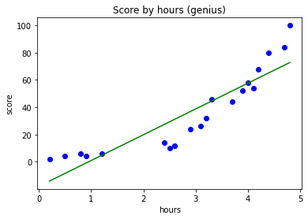
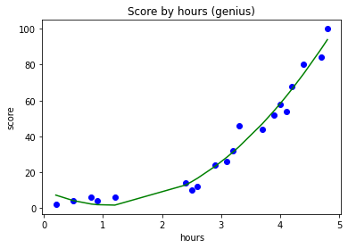
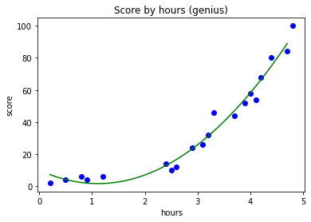
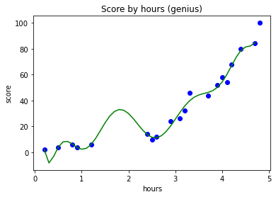

# 3. Polynomial Regression
y = b + m1x + m2x^2 + ... + mnx^n

### 공부시간에 따른 시험 점수 (우등생)


```python
import numpy as np
import matplotlib.pyplot as plt
import pandas as pd
```


```python
dataset = pd.read_csv('PolynomialRegressionData.csv')
X = dataset.iloc[:, :-1].values
y = dataset.iloc[:, -1].values
```

### 3-1. 단순 선형 회귀 (Simple Linear Regression)


```python
from sklearn.linear_model import LinearRegression
reg = LinearRegression()
reg.fit(X, y) # 전체 데이터 학습
```


### 데이터 시각화 (전체)


```python
plt.scatter(X, y, color='blue')
plt.plot(X, reg.predict(X), color='green')
plt.title('Score by hours (genius)')
plt.xlabel('hours')
plt.ylabel('score')
plt.show()
```


    

    


```python
reg.score(X, y) # 전체 데이터를 통한 모델 평가
# 나쁜 점수는 아니지만, 썩 좋은 점수도 아님
```


    0.8169296513411765


### 3-2. 다항 회귀 (Polynomial Regression)


```python
from sklearn.preprocessing import PolynomialFeatures
poly_reg = PolynomialFeatures(degree=2) # 2차 방정식
X_poly = poly_reg.fit_transform(X)
# fit : 새롭게 만들 피쳐 조합 찾기
# transform : 실제로 데이터 변환

X_poly[:5] # 총 20개 있는데 그중 5개
```


    array([[1.  , 0.2 , 0.04],
           [1.  , 0.5 , 0.25],
           [1.  , 0.8 , 0.64],
           [1.  , 0.9 , 0.81],
           [1.  , 1.2 , 1.44]])


```python
X[:5]
```


    array([[0.2],
           [0.5],
           [0.8],
           [0.9],
           [1.2]])


degree=2 즉 2차 방정식에 맞게\
X_poly는 x^0, x^1, x^2을 피쳐로 만든 것

x = 3이라면 [1, 3, 9] 로 변환


```python
poly_reg.get_feature_names_out()
```


    array(['1', 'x0', 'x0^2'], dtype=object)


피쳐 1개일 때 위와 같은 결과\
피쳐 2개 이상이면 더 많은 조합이 만들어질 수 있음


```python
lin_reg = LinearRegression()
lin_reg.fit(X_poly, y) # 변환된 X와 y를 가지고 모델 생성 (학습)
```


### 데이터 시각화 (변환된 X와 y)


```python
plt.scatter(X, y, color='blue')
plt.plot(X, lin_reg.predict(X_poly), color='green')
plt.title('Score by hours (genius)')
plt.xlabel('hours')
plt.ylabel('score')
plt.show()
```


    

    


데이터가 적어서 그래프가 각짐\
각진 그래프를 조금 더 부드럽게 만들고자 함


```python
X_range = np.arange(min(X), max(X), 0.1) # X의 최솟값에서 최댓값까지의 범위를 0.1 단위로 잘라서 데이터 생성
X_range
```


    array([0.2, 0.3, 0.4, 0.5, 0.6, 0.7, 0.8, 0.9, 1. , 1.1, 1.2, 1.3, 1.4,
           1.5, 1.6, 1.7, 1.8, 1.9, 2. , 2.1, 2.2, 2.3, 2.4, 2.5, 2.6, 2.7,
           2.8, 2.9, 3. , 3.1, 3.2, 3.3, 3.4, 3.5, 3.6, 3.7, 3.8, 3.9, 4. ,
           4.1, 4.2, 4.3, 4.4, 4.5, 4.6, 4.7])


```python
X_range.shape # 46개 데이터가 1차원 배열로 있음
```


    (46,)


```python
X[:5] # 2차원 배열 형태
```


    array([[0.2],
           [0.5],
           [0.8],
           [0.9],
           [1.2]])


```python
# X_range를 2차원 배열로 수정
# reshape(row 개수, column 개수)
# row 개수 -1일 때 데이터 전체 계산
# row 개수 len(X_range)로 해도 똑같은 결과

X_range = X_range.reshape(-1, 1) # row 개수는 자동으로 계산, column 개수는 1개
X_range.shape
```


    (46, 1)


```python
X.shape
```


    (20, 1)


```python
X_range[:5]
```


    array([[0.2],
           [0.3],
           [0.4],
           [0.5],
           [0.6]])


```python
plt.scatter(X, y, color='blue')
plt.plot(X_range, lin_reg.predict(poly_reg.fit_transform(X_range)), color='green')
plt.title('Score by hours (genius)')
plt.xlabel('hours')
plt.ylabel('score')
plt.show()
```


    

    


공부 0시간일 때가 성적이 더 좋다고 나와서 아쉬움

2차가 아니라 4차 방정식으로 수정


```python
poly_reg = PolynomialFeatures(degree=4) # 4차 방정식
X_poly = poly_reg.fit_transform(X)

X_poly[:5] # 피쳐 더 많아짐 3개 -> 5개
```


    array([[1.0000e+00, 2.0000e-01, 4.0000e-02, 8.0000e-03, 1.6000e-03],
           [1.0000e+00, 5.0000e-01, 2.5000e-01, 1.2500e-01, 6.2500e-02],
           [1.0000e+00, 8.0000e-01, 6.4000e-01, 5.1200e-01, 4.0960e-01],
           [1.0000e+00, 9.0000e-01, 8.1000e-01, 7.2900e-01, 6.5610e-01],
           [1.0000e+00, 1.2000e+00, 1.4400e+00, 1.7280e+00, 2.0736e+00]])


```python
lin_reg = LinearRegression()
lin_reg.fit(X_poly, y)
```


```python
plt.scatter(X, y, color='blue')
plt.plot(X_range, lin_reg.predict(poly_reg.fit_transform(X_range)), color='green')
plt.title('Score by hours (genius)')
plt.xlabel('hours')
plt.ylabel('score')
plt.show()
```


    

    


### 공부 시간에 따른 시험 성적 예측


```python
reg.predict([[2]]) # 2시간 공부했을 때 선형회귀 모델의 예측값
```


    array([19.85348988])


```python
lin_reg.predict(poly_reg.fit_transform([[2]])) # 2시간 공부했을 때 다항회귀 모델의 예측값
```


    array([8.70559135])


10차 방정식으로 수정


```python
poly_reg = PolynomialFeatures(degree=10)
X_poly = poly_reg.fit_transform(X)

X_poly[:5]
```


    array([[1.00000000e+00, 2.00000000e-01, 4.00000000e-02, 8.00000000e-03,
            1.60000000e-03, 3.20000000e-04, 6.40000000e-05, 1.28000000e-05,
            2.56000000e-06, 5.12000000e-07, 1.02400000e-07],
           [1.00000000e+00, 5.00000000e-01, 2.50000000e-01, 1.25000000e-01,
            6.25000000e-02, 3.12500000e-02, 1.56250000e-02, 7.81250000e-03,
            3.90625000e-03, 1.95312500e-03, 9.76562500e-04],
           [1.00000000e+00, 8.00000000e-01, 6.40000000e-01, 5.12000000e-01,
            4.09600000e-01, 3.27680000e-01, 2.62144000e-01, 2.09715200e-01,
            1.67772160e-01, 1.34217728e-01, 1.07374182e-01],
           [1.00000000e+00, 9.00000000e-01, 8.10000000e-01, 7.29000000e-01,
            6.56100000e-01, 5.90490000e-01, 5.31441000e-01, 4.78296900e-01,
            4.30467210e-01, 3.87420489e-01, 3.48678440e-01],
           [1.00000000e+00, 1.20000000e+00, 1.44000000e+00, 1.72800000e+00,
            2.07360000e+00, 2.48832000e+00, 2.98598400e+00, 3.58318080e+00,
            4.29981696e+00, 5.15978035e+00, 6.19173642e+00]])


```python
lin_reg = LinearRegression()
lin_reg.fit(X_poly, y)
```


```python
plt.scatter(X, y, color='blue')
plt.plot(X_range, lin_reg.predict(poly_reg.fit_transform(X_range)), color='green')
plt.title('Score by hours (genius)')
plt.xlabel('hours')
plt.ylabel('score')
plt.show()
```


    

    


```python
lin_reg.predict(poly_reg.fit_transform([[2]])) # 훈련 데이터에 과대적합되어 이상한 결과
```


    array([29.89734732])


다시 4차 방정식으로 수정


```python
poly_reg = PolynomialFeatures(degree=4)
X_poly = poly_reg.fit_transform(X)

X_poly[:5]
```


    array([[1.0000e+00, 2.0000e-01, 4.0000e-02, 8.0000e-03, 1.6000e-03],
           [1.0000e+00, 5.0000e-01, 2.5000e-01, 1.2500e-01, 6.2500e-02],
           [1.0000e+00, 8.0000e-01, 6.4000e-01, 5.1200e-01, 4.0960e-01],
           [1.0000e+00, 9.0000e-01, 8.1000e-01, 7.2900e-01, 6.5610e-01],
           [1.0000e+00, 1.2000e+00, 1.4400e+00, 1.7280e+00, 2.0736e+00]])


```python
lin_reg = LinearRegression()
lin_reg.fit(X_poly, y)
```


```python
lin_reg.score(X_poly, y)
# 단순 선형회귀 모델에 비해 높은 score
```


    0.9782775579000045

