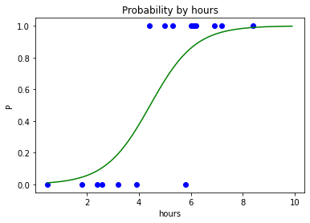
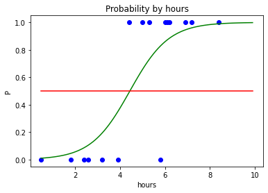
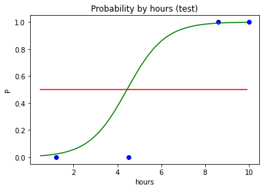

# 4. Logistic Regression

시그모이드 함수 (로지스틱 함수)\
p = 1 / (1 + e^-y)

### 공부 시간에 따른 자격증 시험 합격 가능성


```python
import numpy as np
import matplotlib.pyplot as plt
import pandas as pd
```


```python
dataset = pd.read_csv('LogisticRegressionData.csv')
X = dataset.iloc[:, :-1].values
y = dataset.iloc[:, -1].values
```

### 데이터 분리


```python
from sklearn.model_selection import train_test_split
X_train, X_test, y_train, y_test = train_test_split(X, y, test_size=0.2, random_state=0)
```

### 학습 (로지스틱 회귀 모델)


```python
from sklearn.linear_model import LogisticRegression
classifier = LogisticRegression()
classifier.fit(X_train, y_train)
```


### 6시간 공부했을 때 예측


```python
classifier.predict([[6]]) # 2차원 배열
# 결과 1 : 합격할 것으로 예측
```


    array([1], dtype=int64)


```python
classifier.predict_proba([[6]]) # 합격할 확률 출력
# 불합격 확률 14% 합격 확률 86% -> 합격으로 예측
```


    array([[0.14150735, 0.85849265]])


### 4시간 공부했을 때 예측


```python
classifier.predict([[4]])
# 결과 0 : 불합격할 것으로 예측
```


    array([0], dtype=int64)


```python
classifier.predict_proba([[4]])
# 불합격 확률 62% 합격 확률 38% -> 불합격으로 예측
```


    array([[0.6249966, 0.3750034]])


### 분류 결과 예측 (테스트 세트)


```python
y_pred = classifier.predict(X_test)
y_pred # 예측값
# 결과 : 합격 불합격 합격 합격
```


    array([1, 0, 1, 1], dtype=int64)


```python
y_test # 실제값 (테스트 세트)
# 결과 : 합격 불합격 합격 불합격
```


    array([1, 0, 1, 0], dtype=int64)


```python
X_test # 공부 시간 (테스트 세트)
```


    array([[ 8.6],
           [ 1.2],
           [10. ],
           [ 4.5]])


8.6시간 공부 -> 합격 예측, 실제로 합격\
1.2시간 공부 -> 불합격 예측, 실제로 불합격\
10시간 공부 -> 합격 예측, 실제로 합격\
4.5시간 공부 -> 합격 예측, 실제로 불합격


```python
classifier.score(X_test, y_test) # 모델 평가
# 전체 테스트 세트 4개 중에서 분류 예측을 올바로 맞힌 개수 3개 -> 3/4 = 0.75
```


    0.75


회귀 모델과 달리 분류 모델은 점수 계산 명확

### 데이터 시각화 (훈련 세트)


```python
# 데이터 너무 적어서 각짐
# 부드러운 데이터를 만들기 위해 데이터 늘리기
X_range = np.arange(min(X), max(X), 0.1) # X의 최솟값에서 최댓값까지를 0.1 단위로 잘라서 데이터 생성
X_range
```


    array([0.5, 0.6, 0.7, 0.8, 0.9, 1. , 1.1, 1.2, 1.3, 1.4, 1.5, 1.6, 1.7,
           1.8, 1.9, 2. , 2.1, 2.2, 2.3, 2.4, 2.5, 2.6, 2.7, 2.8, 2.9, 3. ,
           3.1, 3.2, 3.3, 3.4, 3.5, 3.6, 3.7, 3.8, 3.9, 4. , 4.1, 4.2, 4.3,
           4.4, 4.5, 4.6, 4.7, 4.8, 4.9, 5. , 5.1, 5.2, 5.3, 5.4, 5.5, 5.6,
           5.7, 5.8, 5.9, 6. , 6.1, 6.2, 6.3, 6.4, 6.5, 6.6, 6.7, 6.8, 6.9,
           7. , 7.1, 7.2, 7.3, 7.4, 7.5, 7.6, 7.7, 7.8, 7.9, 8. , 8.1, 8.2,
           8.3, 8.4, 8.5, 8.6, 8.7, 8.8, 8.9, 9. , 9.1, 9.2, 9.3, 9.4, 9.5,
           9.6, 9.7, 9.8, 9.9])


```python
# 시그모이드 함수 (로지스틱 함수)
# p = 1 / (1 + e^-y) : 원래 식
# p = 1 / (1 + np.exp(-y)) : np로 표현

# y = mx + b 꼴로 수정
# m = classifier.coef_
# X = X_range
# b = classifier.intercept_
p = 1 / (1 + np.exp(-(classifier.coef_ * X_range + classifier.intercept_)))
p
```


    array([[0.01035705, 0.01161247, 0.01301807, 0.0145913 , 0.01635149,
            0.01832008, 0.02052073, 0.02297953, 0.02572521, 0.02878929,
            0.03220626, 0.03601375, 0.04025264, 0.04496719, 0.05020505,
            0.05601722, 0.06245802, 0.06958479, 0.07745757, 0.08613861,
            0.09569165, 0.10618106, 0.11767067, 0.13022241, 0.14389468,
            0.15874043, 0.17480509, 0.19212422, 0.2107211 , 0.23060425,
            0.25176509, 0.27417574, 0.29778732, 0.32252874, 0.34830616,
            0.3750034 , 0.40248315, 0.43058927, 0.45914989, 0.48798142,
            0.51689314, 0.54569221, 0.57418876, 0.60220088, 0.6295591 ,
            0.65611024, 0.68172044, 0.70627722, 0.72969059, 0.75189324,
            0.77283994, 0.79250621, 0.81088652, 0.82799203, 0.84384828,
            0.85849265, 0.871972  , 0.88434036, 0.89565683, 0.90598377,
            0.91538521, 0.92392546, 0.93166808, 0.93867499, 0.9450058 ,
            0.95071738, 0.95586346, 0.96049453, 0.96465764, 0.96839647,
            0.97175136, 0.97475939, 0.97745455, 0.97986786, 0.9820276 ,
            0.98395944, 0.98568665, 0.9872303 , 0.98860939, 0.98984107,
            0.9909408 , 0.99192244, 0.99279849, 0.99358014, 0.99427745,
            0.9948994 , 0.99545406, 0.99594865, 0.99638963, 0.99678276,
            0.99713321, 0.99744558, 0.997724  , 0.99797213, 0.99819325]])


```python
p.shape # 2차원 배열
```


    (1, 95)


```python
X_range.shape # 1차원 배열
```


    (95,)


```python
p = p.reshape(-1) # 1차원 배열 형태로 변경 (len(p)를 넣어도 똑같은 결과)
p.shape
```


    (95,)


```python
plt.scatter(X_train, y_train, color='blue')
plt.plot(X_range, p, color='green')
plt.title('Probability by hours')
plt.xlabel('hours')
plt.ylabel('P')
plt.show()
```


    

    


```python
# 중간 0 값을 나타내는 선 추가
plt.scatter(X_train, y_train, color='blue')
plt.plot(X_range, p, color='green')
plt.plot(X_range, np.full(len(X_range), 0.5), color='red') # X_range 개수만큼 0.5로 가득찬 배열 만들기
plt.title('Probability by hours')
plt.xlabel('hours')
plt.ylabel('P')
plt.show()
```


    

    


### 데이터 시각화 (테스트 세트)


```python
plt.scatter(X_test, y_test, color='blue')
plt.plot(X_range, p, color='green')
plt.plot(X_range, np.full(len(X_range), 0.5), color='red')
plt.title('Probability by hours (test)')
plt.xlabel('hours')
plt.ylabel('P')
plt.show()
```


    

    


```python
classifier.predict_proba([[4.5]]) # 4.5시간 공부했을 때 확률 (모델에서는 합격 예측, 실제로는 불합격)
# 모델에서는 51% 확률로 합격 예측
```


    array([[0.48310686, 0.51689314]])


### 혼동 행렬 (Confusion Matrix)


```python
from sklearn.metrics import confusion_matrix
cm = confusion_matrix(y_test, y_pred)
cm

# TRUE NEGATIVE (TN)  FALSE POSITIVE (FP)
# 불합격 예측        합격 예측
# 불합격 실제        불합격 실제

# FLASE NEGATIVE (FN)  TRUE POSITIVE (TP)
# 불합격 예측        합격 예측
# 합격 실제          합격 실제
```


    array([[1, 1],
           [0, 2]], dtype=int64)

