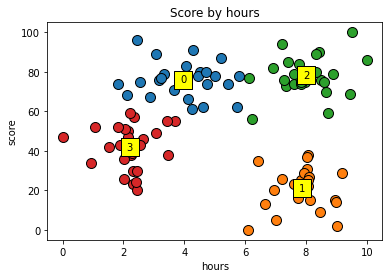

# 5. K-Means


```python
# from ... import StandardScaler 이전에 코드 넣으면 경고문 안 뜸
import os
os.environ['OMP_NUM_THREADS'] = '1'
```


```python
import numpy as np
import matplotlib.pyplot as plt
import pandas as pd
```


```python
dataset = pd.read_csv('KMeansData.csv')
dataset[:5]
```


<table border="1" class="dataframe">
  <thead>
    <tr style="text-align: right;">
      <th></th>
      <th>hour</th>
      <th>score</th>
    </tr>
  </thead>
  <tbody>
    <tr>
      <th>0</th>
      <td>7.33</td>
      <td>73</td>
    </tr>
    <tr>
      <th>1</th>
      <td>3.71</td>
      <td>55</td>
    </tr>
    <tr>
      <th>2</th>
      <td>3.43</td>
      <td>55</td>
    </tr>
    <tr>
      <th>3</th>
      <td>3.06</td>
      <td>89</td>
    </tr>
    <tr>
      <th>4</th>
      <td>3.33</td>
      <td>79</td>
    </tr>
  </tbody>
</table>
</div>


```python
# 정답이 없는 비지도학습이라 종속변수(y) 없음
X = dataset.iloc[:, :].values
# X = dataset.values : 위와 같은 결과
# X = dataset.to_numpy() : 공식 홈페이지에서 권장하는 방법
X[:5]
```


    array([[ 7.33, 73.  ],
           [ 3.71, 55.  ],
           [ 3.43, 55.  ],
           [ 3.06, 89.  ],
           [ 3.33, 79.  ]])


### 데이터 시각화 (전체 데이터 분포 확인)


```python
plt.scatter(X[:, 0], X[:, 1]) # x축 : hour, y축 : score
plt.title('Score by hours')
plt.xlabel('hours')
plt.ylabel('score')
plt.show()
```


    

    


x축은 0-10, y축은 0-100\
K-Means는 유클리드 거리로 계산하기 때문에\
점이 세로로 가까이, 가로로 멀리 놓여도 세로로 놓인 게 더 멂

### 데이터 시각화 (축 범위 통일)


```python
plt.scatter(X[:, 0], X[:, 1])
plt.title('Score by hours')
plt.xlabel('hours')
plt.xlim(0, 100) # x축 범위 0~100으로 수정
plt.ylabel('score')
plt.ylim(0, 100) # y축 범위 0~100
plt.show()
```


    

    


축 범위 통일 이전 멀어 보였던 가로 점들이\
축 범위를 통일하자 실제로 세로로 놓인 점들보다 가까웠다는 걸 알 수 있음

### 피쳐 스케일링 (Feature Scaling)


```python
from sklearn.preprocessing import StandardScaler
sc = StandardScaler()
X = sc.fit_transform(X)
X[:5]
```


    array([[ 0.68729921,  0.73538376],
           [-0.66687438,  0.04198891],
           [-0.77161709,  0.04198891],
           [-0.9100271 ,  1.35173473],
           [-0.8090252 ,  0.96651537]])


### 데이터 시각화 (스케일링된 데이터)


```python
plt.figure(figsize=(5, 5)) # 정사각형 꼴
plt.scatter(X[:, 0], X[:, 1])
plt.title('Score by hours (scaling)')
plt.xlabel('hours')
plt.ylabel('score')
plt.show()
```


    

    


첫 그래프와 같은 산점도지만, 축 범위가 통일돼 있음

### 최적의 K 값 찾기 (엘보우 방식 Elbow Method)


```python
from sklearn.cluster import KMeans
inertia_list = []
for i in range(1, 11):
    kmeans = KMeans(n_clusters=i, init='k-means++', n_init=10, random_state=0)
    # 'k-means++' : 랜덤이 아니라 개선된 방식(한 점 잡고 거기서 가장 먼 점 잡기)으로 centroid 점(중심점) 찾음
    # 'k-means++' 사용 시 n_init=10 안 하면 경고문 뜸
    kmeans.fit(X)
    inertia_list.append(kmeans.inertia_) # 각 지점으로부터 클러스터의 중심(centroid)까지의 거리의 제곱의 합

plt.plot(range(1, 11), inertia_list)
plt.title('Elbow Method')
plt.xlabel('n_clusters')
plt.ylabel('intertia')
plt.show()
```


    

    


### 최적의 K 값(=4)으로 KMeans 학습


```python
K = 4 # 최적의 K 값
```


```python
kmeans = KMeans(n_clusters=K, random_state=0, n_init=10) # init 기본값이 'k-means++'
y_kmeans = kmeans.fit_predict(X)
```


```python
y_kmeans
```


    array([2, 3, 3, 0, 0, 1, 1, 0, 2, 0, 0, 3, 1, 3, 3, 0, 1, 2, 3, 0, 1, 0,
           3, 1, 2, 2, 3, 3, 3, 3, 1, 1, 3, 0, 2, 2, 3, 0, 0, 0, 3, 1, 2, 3,
           3, 2, 1, 0, 1, 1, 2, 0, 1, 1, 0, 0, 0, 0, 3, 1, 1, 2, 2, 2, 2, 1,
           1, 0, 1, 2, 3, 2, 2, 2, 3, 3, 3, 3, 0, 2, 1, 2, 1, 1, 2, 0, 3, 1,
           2, 3, 0, 1, 0, 2, 3, 2, 2, 0, 1, 3])


### 데이터 시각화 (최적의 K)


```python
for cluster in range(K):
    plt.scatter(X[y_kmeans == cluster, 0], # 컬럼값 0 -> hour
                X[y_kmeans == cluster, 1], # 컬럼값 1 -> score
               s=100, edgecolor='black') # 점 size 키우고 테두리색 검정으로 변경

plt.title('Score by hours')
plt.xlabel('hours')
plt.ylabel('score')
plt.show()
```


    

    


```python
# 클러스터 정보 추가
centers = kmeans.cluster_centers_ # 클러스터의 중심점(centroid) 좌표
centers
```


    array([[-0.57163957,  0.85415973],
           [ 0.8837666 , -1.26929779],
           [ 0.94107583,  0.93569782],
           [-1.22698889, -0.46768593]])


```python
# 클러스터 중심점 확인
for cluster in range(K):
    plt.scatter(X[y_kmeans == cluster, 0], X[y_kmeans == cluster, 1], s=100, edgecolor='black')
    plt.scatter(centers[cluster, 0], centers[cluster, 1], s=300, edgecolor='black',
               color='yellow', marker='s') # 네모나고 노란 점
    
plt.title('Score by hours')
plt.xlabel('hours')
plt.ylabel('score')
plt.show()
```


    

    


```python
# 클러스터 숫자 입력
for cluster in range(K):
    plt.scatter(X[y_kmeans == cluster, 0], X[y_kmeans == cluster, 1], s=100, edgecolor='black')
    plt.scatter(centers[cluster, 0], centers[cluster, 1], s=300, edgecolor='black', color='yellow', marker='s')
    plt.text(centers[cluster, 0], centers[cluster, 1], cluster) # 텍스트값 : cluster(0~4)
           
plt.title('Score by hours')
plt.xlabel('hours')
plt.ylabel('score')
plt.show()
```


    

    


```python
# 클러스터 숫자 중심에 위치
for cluster in range(K):
    plt.scatter(X[y_kmeans == cluster, 0], X[y_kmeans == cluster, 1], s=100, edgecolor='black')
    plt.scatter(centers[cluster, 0], centers[cluster, 1], s=300, edgecolor='black', color='yellow', marker='s')
    plt.text(centers[cluster, 0], centers[cluster, 1], cluster,
            va='center', ha='center') # 텍스트가 세로로(va) 가로로(ha) 전부 중간에 오도록
    
plt.title('Score by hours')
plt.xlabel('hours')
plt.ylabel('score')
plt.show()
```


    

    


### 데이터 시각화 (스케일링 원상복구)


```python
X_org = sc.inverse_transform(X) # Feature Scaling 된 데이터를 다시 원복
X_org[:5]
```


    array([[ 7.33, 73.  ],
           [ 3.71, 55.  ],
           [ 3.43, 55.  ],
           [ 3.06, 89.  ],
           [ 3.33, 79.  ]])


```python
centers_org = sc.inverse_transform(centers)
centers_org
```


    array([[ 3.96458333, 76.08333333],
           [ 7.8552    , 20.96      ],
           [ 8.0084    , 78.2       ],
           [ 2.21269231, 41.76923077]])


```python
# X -> X_org
# centers -> centers_org

for cluster in range(K):
    plt.scatter(X_org[y_kmeans == cluster, 0], X_org[y_kmeans == cluster, 1], s=100, edgecolor='black')
    plt.scatter(centers_org[cluster, 0], centers_org[cluster, 1], s=300, edgecolor='black', color='yellow', marker='s')
    plt.text(centers_org[cluster, 0], centers_org[cluster, 1], cluster, va='center', ha='center')

plt.title('Score by hours')
plt.xlabel('hours')
plt.ylabel('score')
plt.show()
```


    

    


0번째 : 공부 시간 적은데 상대적으로 점수 높음\
공부의 효율성 높으므로 다른 과목에 시간 더 분배하도록 가이드

1번째 : 공부 시간 많은데 점수 낮음\
공부의 효율성 떨어지거나 실전에 약한 타입

2번째 : 공부 시간 많고 점수 높음\
어떻게 하면 0번째가 될 수 있을지 효율성 고민

3번째 : 공부 시간 적고 점수 낮음\
공부하도록 격려
