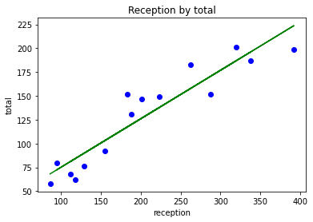
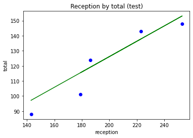

# 6. Quiz

### 어느 결혼식장에서 피로연의 식수 인원을 올바르게 예측하지 못하여 버려지는 음식으로 고민이 많다고 합니다. 현재까지 진행된 결혼식에 대한 결혼식 참석 인원과 그 중에서 식사를 하는 인원의 데이터가 제공될 때, 아래 각 문항에 대한 코드를 작성하시오.


```python
import numpy as np
import matplotlib.pyplot as plt
import pandas as pd
```

### 1) QuizData.csv 파일로부터 데이터를 읽어와서 결혼식 참석 인원(total), 식수 인원(reception)을 각각의 변수로 저장하시오.


```python
dataset = pd.read_csv('QuizData.csv')
dataset.head()
```


<div>

<table border="1" class="dataframe">
  <thead>
    <tr style="text-align: right;">
      <th></th>
      <th>total</th>
      <th>reception</th>
    </tr>
  </thead>
  <tbody>
    <tr>
      <th>0</th>
      <td>118</td>
      <td>62</td>
    </tr>
    <tr>
      <th>1</th>
      <td>253</td>
      <td>148</td>
    </tr>
    <tr>
      <th>2</th>
      <td>320</td>
      <td>201</td>
    </tr>
    <tr>
      <th>3</th>
      <td>94</td>
      <td>80</td>
    </tr>
    <tr>
      <th>4</th>
      <td>155</td>
      <td>92</td>
    </tr>
  </tbody>
</table>
</div>


```python
X = dataset.iloc[:, 0].values # X.shape의 결과가 달라지므로 .iloc[:, [0]] or .iloc[:, :-1]을 써야 함
y = dataset.iloc[:, 1].values

X, y
```


    (array([118, 253, 320,  94, 155, 188, 201, 338, 186, 183, 223, 392,  86,
            112, 129, 223, 288, 262, 143, 179], dtype=int64),
     array([ 62, 148, 201,  80,  92, 131, 147, 187, 124, 152, 143, 199,  58,
             68,  76, 149, 152, 183,  88, 101], dtype=int64))


### 2) 전체 데이터를 훈련 세트와 테스트 세트로 분리하시오. 이때 비율은 75 : 25로 합니다.


```python
from sklearn.model_selection import train_test_split

X_train, X_test, y_train, y_test = train_test_split(X, y, test_size=0.25, random_state=0)
```

### 3) 훈련 세트를 이용하여 단순 선형 회귀 (Simple Linear Regression) 모델을 생성하시오.


```python
from sklearn.linear_model import LinearRegression

reg = LinearRegression()
reg.fit(X_train.reshape(-1, 1), y_train)
```


### 4) 데이터 시각화 (훈련 세트) 코드를 작성하시오.


```python
plt.scatter(X_train, y_train, color='blue')
plt.plot(X_train, reg.predict(X_train.reshape(-1, 1)), color='green')
plt.title('Reception by total')
plt.xlabel('reception')
plt.ylabel('total')
plt.show()
```


    

    


### 5) 데이터 시각화 (테스트 세트) 코드를 작성하시오.


```python
plt.scatter(X_test, y_test, color='blue')
plt.plot(X_test, reg.predict(X_test.reshape(-1, 1)), color='green')
plt.title('Reception by total (test)')
plt.xlabel('reception')
plt.ylabel('total')
plt.show()
```


    

    


### 6) 훈련 세트, 테스트 세트에 대해 각각 모델 평가 점수를 구하시오.


```python
reg.score(X_train.reshape(-1, 1), y_train)
```


    0.8707088403321211


```python
reg.score(X_test.reshape(-1, 1), y_test)
```


    0.8634953212566615


### 7) 결혼식 참석 인원이 300명일 때 예상되는 식수 인원을 구하시오.


```python
reg.predict([[300]])
```


    array([176.92793218])


177 명
